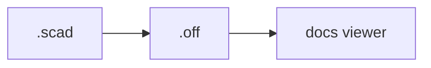

# Theme Components

A short cheat-sheet of the [Just the Docs] features used most in OpenSCAD docs.
See the [theme documentation][Just the Docs] for the full set.

## OpenSCAD code blocks

This template registers an OpenSCAD lexer — fence code with `scad` (or
`openscad`) for highlighting:

```scad
module widget(size = 10) {
  cube([size, size, size / 2], center = true);
}
widget(20);
```

## Callouts

Set off notes and warnings with a class before the paragraph:

{: .note }
`use <lib.scad>` imports modules and functions; `include <lib.scad>` also runs
the file's top-level code.

{: .warning }
Model geometry is cached — bump `$fn` or re-render if a change doesn't show.

Configured callout types: `highlight`, `important`, `new`, `note`, `warning`
(see `_config.yml`).

## Tables

| Format | Use                          |
| ------ | ---------------------------- |
| `.off` | geometry the docs viewer shows |
| `.stl` | printing / slicing            |
| `.png` | a static poster image         |

## Diagrams

Mermaid is enabled — fence a diagram with `mermaid`:



[Just the Docs]: https://just-the-docs.github.io/just-the-docs/
